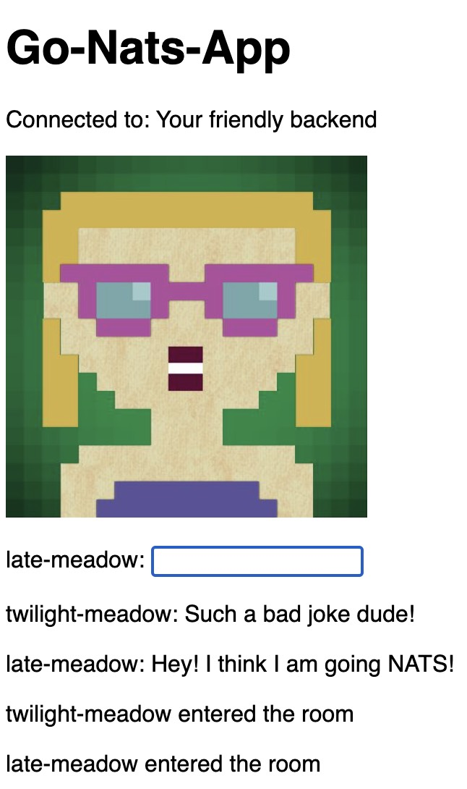

# Go-Nats-App

This is a demo of a [Go-App](https://github.com/maxence-charriere/go-app) based PWA that uses [NATS](https://nats.io/) for the communication between frontend and backend.

### How to run it?

Clone the repository, cd into it and run `go run mage.go run` (or `mage run` if you installed mage already). 

Then open http://127.0.0.1:8500 once or multiple times in your browser and chat with yourself. 

### Features of this demo:

- There is no java-script! Everything is Go code.
  - Frontend & Backend uses [Go-App](https://github.com/maxence-charriere/go-app).
  - Build tooling made with [Mage](https://magefile.org/).
- The frontend is a PWA and can be installed on your phone or desktop. It runs in the browser as WASM code with a service-worker.
- We are using an embedded NATS-Server in the backend to offer three services:
  - [Govatar](https://github.com/o1egl/govatar) image (jpeg / random / female).
  - Chat broker (3 lines of code + error handling = 10 lines).
  - (New) Each PWA has a echo "req" service under the subject "echo.<name of the user>". Like "echo.late-meadow" in our example picture. An example command-line is shown in the site.
- We use the original nats.go client in the frontend.
- Go-App code is smaller when building WASM and normal code separately.
- We compress the WASM code on the fly.
- You can run the embedded nats-server as leaf-node of a cluster (that is what we do in another proof of concept).

###  What does not work:

- This will not work with TLS (`wss://`) with before the next release of [Nats.go](https://github.com/nats-io/nats.go) (after 1.20.0). If you need TLS for the websocket you can use `go get https://github.com/nats-io/nats.go@main` which shoud work for that. The code in the demo does contain everything needed though (implementation of `SkipTLSHandshake()` on the `CustomDialer`).
- The IPs and ports are hardcoded and as everything binds to localhost it will not work behind reverse proxies or through tunnels like [sish](https://github.com/antoniomika/sish) or ngrok.
- a lot more. It is just a proof of concept / demo.

### Disclaimer
- We do not care what you do with the code as long as you do not bug us or destroy humanity with it :)
- This uses the MIT Licence and is as it is what it is.
- Parts of the code were quickly grabbed from other internal prototypes or written without much though. It is most likely full of bugs :)

### Greetings

- to the NATS Team
- to the Go-App developer
- all the contributors
- and to everybody else :)
